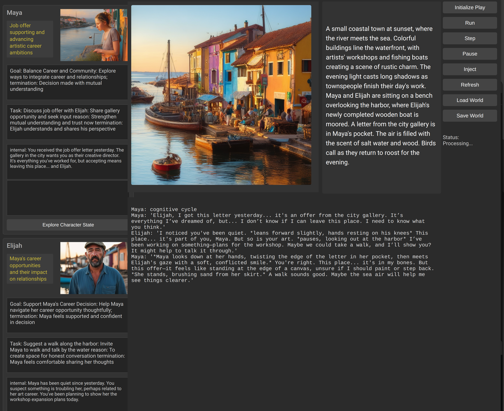

# AllTheWorldAPlay[^1] (ATWAP)

## A playground for cognitive software. 



## A stage on which plays are presented, with AI cognitive agents as actors.

What's a cognitive agent? Well^1, *agents* are entities that can do things. *cognition* is using explicit representation and reasoning. So AI cognitive agents are hardware/software-based entities that build and reason over explicit representations to think and act. These do so on a stage.

Why? 
- My AGB (artificial general Being) test - In order for these plays to be interesting, the actors must be *interesting* for a sufficiently long period of time (longer than the typical chatbot is the first threshold).
- 
script a simple scenario, and watch it play out. 
I've only put two days into this so far.
- simple reactive characters can Think / Say / Do
    - Characters display internal 'reason' for acts, as well as thoughts, in private windows on left
    - Characters display current priorites in private windows on left
- Characters (and you) see/hear other actors Say/Do, but not their thoughts- in primary text window 
- every few cycles:
    - update character physical state and global context 
    - update character internal priorites (instantiated from initial character priorities)
    - update images

## Example script (simple Lost in the wild scenario):

Not as bad as it looks, lots of comments. :)
```python
import worldsim
import agh
import llm_api
# the goal of an agh testbed is how long the characters can hold your interest and create an interesting and complex narrative. This is a classic 'survivors' sci-fi scenario. 

# Create characters
# I like looking at pretty women. pbly because I'm male hetero oriented.
# If that offends, please change to suit your fancy.
# I find it disorienting for characters to change enthicity every time they are rendered, so I nail that down here.
# I'm of Sicilian descent on my mother's side (no, not Italian - family joke).

S = agh.Agh("Samantha", """You are a pretty young woman of Sicilian descent. 
You love the outdoors and hiking.
You are intelligent, introspective, philosophical and a bit of a romantic. 
You are very informal, chatty, think and speak in teen slang, and are a playful and flirty when relaxed. 
You are comfortable on long treks, and are unafraid of hard work. 
You are suspicious by nature, and wary of strangers. 
Your name is Samanatha""")

# Drives are what cause a character to create tasks.
# Below is the default an agh inherits if you don't override, as we do below.
# basic Maslow (more or less).
# As usual, caveat, check agh.py for latest default!
# - immediate physiological needs: survival, water, food, clothing, shelter, rest.  
# - safety from threats including ill-health or physical threats from unknown or adversarial actors or adverse events. 
# - assurance of short-term future physiological needs (e.g. adequate water and food supplies, shelter maintenance). 
# - love and belonging, including mutual physical contact, comfort with knowing one's place in the world, friendship, intimacy, trust, acceptance.

# Overriding for this scenario, otherwise all they do is hunt for water, berries, and grubs
# Rows are in priority order, most important first. Have fun.
# note this is NOT NECESSARY to specify if you don't want to change anything.

S.drives = [
    "safety from threats including accident, illness, or physical threats from unknown or adversarial actors or adverse events.", 
    "finding a way out of the forest.",
    "solving the mystery of how she ended up in the forest with no memory.",
    "love and belonging, including home, acceptance, friendship, trust, intimacy.",
    "immediate physiological needs: survival, shelter, water, food, rest."
]

# Don't need this in general, but you can use it to set character's initial tone.
# Be careful untill you get a sense of how characters use thoughts.
# I recommend you don't try anything that doesn't start with 'You think ' unless you want to dig into code.

S.add_to_history("You think This is very very strange. Where am i? I'm near panic. Who is this guy? How did I get here? Why can't I remember anything?")

#
## Now Joe, the other character in this 'survivor' scenario
#

J = agh.Agh("Joe", """You are a young male of Sicilian descent, intelligent and self-sufficient. 
You are informal and somewhat impulsive. 
You are strong, and think you love the outdoors, but are basically a nerd.
You are socially awkward, especially around strangers. Your name is Joe.""")

J.drives = S.drives

J.add_to_history("You think Ugh. Where am I?. How did I get here? Why can't I remember anything? Who is this woman?")
# add a romantic thread. Doesn't accomplish much. One of my test drivers of agh, actually.
J.add_to_history("You think Whoever she is, she is pretty!")


# Now world initialization
# first sentence of context is part of character description for image generation.
# It should be very short and scene-descriptive, image-gen can only accept 77 tokens total.

W = agh.Context([S, J],
                """A temperate, mixed forest-open landscape with no buildings, roads, or other signs of humananity. It is a early morning on what seems like it will be a warm, sunny day.
""")

# Image server defaults to local homebrew. dall-e-2 has long lag, so it only regens an image 1 out of 7 calls (random).
# Of course, you need an openai account for dall-e-2. PRs for better options encouraged.
#  set OS.env OPENAI_API_KEY 
#  worldsim.IMAGEGENERATOR = 'dall-e-2'
worldsim.IMAGEGENERATOR = 'tti_serve'

worldsim.main(W)

#worldsim.main(W, server='Claude') # yup, Claude is supported. But RUN LOCAL OSS if you can!
# alternatives include utils/exl_server (exllamav2), hf_server (HF transformers wrapper), llama.cpp (almost working)
#worldsim.main(W, server='llama.cpp')
```

## Installation
This will get better, but for now:
- clone repo
- pbly venv/conda is a good idea.
- you will need lots of stuff. pyqt5, Transformers, pytorch, exllamav2 (to use the exllamav2 server), stabilityai/sdxl-turbo, etc etc etc.
    but you probably know the drill
    unless you've never run an OSS llm locally outside wrappers like ollama or gui's like tabby or ...,
    in which case you pbly shouldn't try this till I package it.
- in utils, run exl_server.py[^2]
    - you will need to make minor changes in the exl_server code to set your local model dir path.
    - it will ask which model to load.
    - you will need exllamav2 and transformers installed (code uses transformers tokenizer to run chat templates)
- in utils, run tti_serve.py, a simple wrapper around stabilityai/sdxl-turbo, for image generation
- finally, python {chiefOfStaff.py, lost.py, myscenario.py, ...} from <localrepo>/src directory[^3]. 

## Coming Soon
I'm less than 2 weeks into this project. Immeadiate projects:
- better management of task 'stickiness'
- better awareness of / adaptation to other characters words and acts
- longer term awareness of important environment events
- character development?
- ...? I realize gamers got here long before me. Skill acquisition, inventory, better location modeling, ... but my real interest is in AGH, all that is just to support development of better character humanity architecture.
- config file.
Ideas / contributions (via PRs?) most welcome.

[^1]: With all due respect, master, the world is NOT a stage. It is not a mere backdrop for human activity. The world IS THE PLAY,we humans no more significant than any of the myriad other actors comprising it.
[^2]: a simple wrapper around exllamav2. Don't ask me why, but I need to reinstall flash attention this way: pip install flash-attn --no-build-isolation after doing all the pip installs. I hate python packaging. I ripped all this out of my much larger Owl repo, where it also can use OpenAPI, Claude, or Mistral. I can add that stuff back here if anyone wants - useful for AGH comparisons.
[^3]: Yeah, I know, no requirements.txt or other installer? Hey, this is <really> early, sorry. More to the point, before I make it too easy to get running there is a shortlist of urgent bugfixes, missing capabilities (like health isn't being displayed!) and improvements (esp. in planning, action determination, ....) I need to make.
[^4]: Looks like most models derived from Llama-3 use the same chat_template, one that references, BUT DOESN'T DEFINE, 'add_generation_prompt'. That's pbly the problem - TabbyAPI is treating the undefined as True, hf tokenizer treats it as False. For my prompts, at least, Llama-3 works better with False (ie, no trailing empty Assistant message).
[^5]: I'd LOVE to have more imagegen options. Not my area. Suggestions / contributions most welcom.
