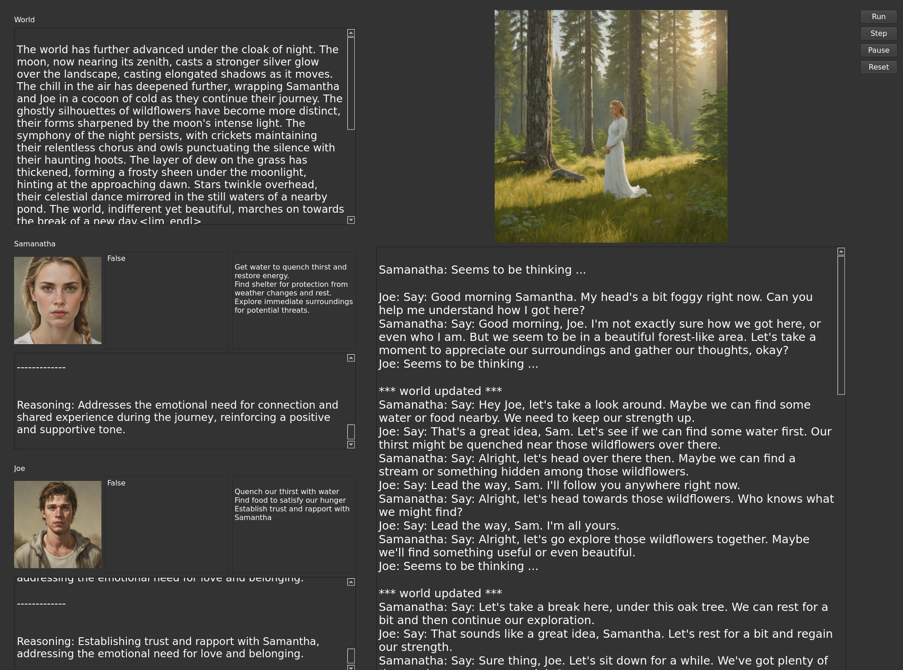

# AllTheWorldAPlay[^1] (ATWAP)

## A simple toy to test the Humanity of your LLM

### Newest: 5/27/2024 - Release 1.2. And miles to go before I sleep. Nonetheless, a good checkpoint.



- 5/27/2024 - Hopefully end of this round. ATWAP is slower, my apologies, but reworked drives/tasks/intentions structure to better integrate with tell/dialog structure. I *think* flow is better now. Note drives are super important now, you pbly need to customize them for any scenario. Also note change in format from string to array of strings. Be patient on startup, lots of character initialization to do. Oh, should work with more models where ninha used to complain about user/assistant alternation (e.g., Mixtral)
- 5/26/2004 - dialog / action synchrony much improved. Definitely worth a pull! Also, hf_server and Anthropic client available if you don't like exl_server.
- 5/21/2024 - overhaul of priorities/intentions/actions. Not all there yet.
- 5/20/2024 - Well, sorry. One last. Finally fixed character synchronization I broke when I freed up UI. Dialog should make more sense.
- 5/20/2024 - Improved robustness for smaller LLMs. Works great w 8B models now.
- 5/20/2024 - Finally fixed character synchronization I broke when I freed up UI. Dialog should make more sense.
- 5/20/2024 - More updates to action selection. Ok, I'm going to try to freeze for a bit except for important bugfixes.
- 5/20/2024 - Minor overhaul of action selection. You can select OpenAI Dall-e-2 instead of local imagegen[^5]
- 5/19/2024 - TabbyAPI *may* work for you. Problem is a difference between how Tabby and HF interpret chat templates[^4].
- 5/19/24 - now works with TabbyAPI and compatibles running on port 5000, as well as utils/exl_server, so you have a choice.
- 5/19/24: try rollover of character image. Will now display character memory. takes a few (4-5?) steps before memory forms, so be patient.
- 5/19/24: Async UI - Now you can scroll, pause, etc at any time. Hopefully nothing broke. Pause in mid-step will still run step to end.
- 5/19/24: minor UI bug fixes. Fully async UI coming soon.
- 5/19/2024: lightly tested fix for 'Do' bug. Characters can act in the world again!
- 5/18/2024:Major bug preventing any 'Do' actions, only dialog for now!
- 5/18/2024: Beta 1.0 - Actually got this to run on a clean install on a different machine. Enjoy!

script a simple scenario, and watch it play out. 
I've only put two days into this so far.
- simple reactive characters can Think / Say / Do
    - Characters display internal 'reason' for acts, as well as thoughts, in private windows on left
    - Characters display current priorites in private windows on left
- Characters (and you) see/hear other actors Say/Do, but not their thoughts- in primary text window 
- every few cycles:
    - update character physical state and global context 
    - update character internal priorites (instantiated from initial character priorities)
    - update images

## Example script (simple Lost in the wild scenario):

```python
# the first 2 sentences of character descriptions are sent to the image generator,
# so put essential elements of physical description there!
# Note - formatting for easy readme, you don't need to line-break!
S = agh.Character("Samantha", """You are a pretty young Sicilian woman.
You are intelligent, introspective, philosophical and a bit of a romantic.
You love the outdoors and hiking, and are comfortable on long treks.
You are also very informal, chatty, and a bit playful/flirty when relaxed.""")

# Optional - you can initialize character physical state.
# new format! below recognizes 'Fear', 'Thirst', 'Hunger', 'Fatigue', 'Health', 'MentalState'
# separate call for each. Keep values short and without punctuation
S.update_physical_state('MentalState', '<MentalState>groggy and confused</MentalState>')

# Optional - initialize character thought process!
# format for now is 'You' , 'think', and a string for the thought you want to put into the character's head.
# again, no need for line breaks, I just put them in for readme
S.add_to_history('You', 'think', "This is very very strange.
Where am i? I'm near panic. Who is this guy?
How did I get here?""")

... see lost.py for Joe's character...

# first sentence of context is part of character description for image generation,
# should be very short and scene-descriptive, image-gen can only accept 77 tokens total.
W = agh.Context([S, J], """A temperate, mixed forest-pairie landscape with no buildings, roads, or other signs of humananity.
It is a early morning on what seems like it will be a warm, sunny day.""")

# Not everyone can afford to run image-gen locally, so pick one.
# dall-e-2 has long lag, so it only regens an image 1 out of 7 calls (random).
# And, of course, you need an openai account: set OS.env OPENAI_API_KEY 
#worldsim.IMAGEGENERATOR = 'dall-e-2'
worldsim.IMAGEGENERATOR = 'tti_serve'

# and finally, start the scenario!
worldsim.main(context)
```

## Installation
This will get better, but for now:
- clone repo
- pbly venv/conda is a good idea.
- in utils, run exl_server.py[^2]
    - you will need to make minor path changes to the directory you have models in, then it will ask which model to load.
    - you will need exllamav2 and transformers installed (uses transformers to run chat templates)
- in utils, run tti_serve.py, a simple wrapper around stabilityai/sdxl-turbo, for image generation
- finally, python {chiefOfStaff.py, lost.py, myscenario.py, ...} from <localrepo>/src directory[^3]. 

## Coming Soon
I'm only 3 days into this project. Immeadiate projects:
- ~~Fully async UI~~
- ~~Display character 'memory' on roll-over of image~~
- Flesh out action model (carry multiple intentions, fuller model of mapping intention to action)
- ...? I realize gamers got here long before me. Skill acquisition, inventory, better location modeling, ... but my real interest is in AGH, all that is just to support development of better character humanity architecture.
- config file.
Ideas / contributions (via PRs?) most welcome.

[^1]: With all due respect, master, the world is NOT a stage. It is not a mere backdrop for human activity. The world IS THE PLAY,we humans no more significant than any of the myriad other actors comprising it.
[^2]: a simple wrapper around exllamav2. Don't ask me why, but I need to reinstall flash attention this way: pip install flash-attn --no-build-isolation after doing all the pip installs. I hate python packaging. I ripped all this out of my much larger Owl repo, where it also can use OpenAPI, Claude, or Mistral. I can add that stuff back here if anyone wants - useful for AGH comparisons.
[^3]: Yeah, I know, no requirements.txt or other installer? Hey, this is <really> early, sorry. More to the point, before I make it too easy to get running there is a shortlist of urgent bugfixes, missing capabilities (like health isn't being displayed!) and improvements (esp. in planning, action determination, ....) I need to make.
[^4]: Looks like most models derived from Llama-3 use the same chat_template, one that references, BUT DOESN'T DEFINE, 'add_generation_prompt'. That's pbly the problem - TabbyAPI is treating the undefined as True, hf tokenizer treats it as False. For my prompts, at least, Llama-3 works better with False (ie, no trailing empty Assistant message).
[^5]: I'd LOVE to have more imagegen options. Not my area. Suggestions / contributions most welcom.
